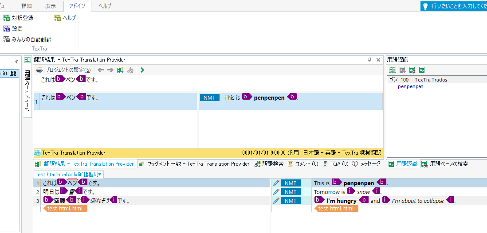
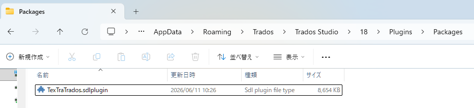
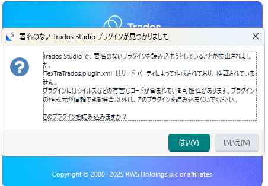
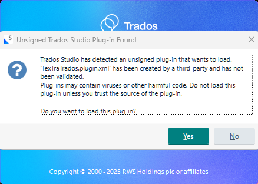

#  TexTra Trados

**TexTra Trados**は  
SDL社、翻訳支援アプリ「Trados」に 
**「みんなの自動翻訳」** を利用した翻訳機能を提供するアドインです。 

**TexTra Trados** is an add‑in for SDL's translation support application "Trados"  
that provides translation functionality using **"Min'na no Jidou Hon'yaku"**. 

---

## 📥インストール Install

アドインファイル、TexTraTrados.sdlpluginを 
本画面の「Releases」からダウンロードして実行してください。 
https://github.com/NICT-Dev/TexTra-Trados/releases 

ダウンロードしたアドインファイルを 
Tradosのアドインフォルダに配置してください。 
（アドインフォルダは
、Tradosインストール後、自動で作成されています。） 
 
アドインフォルダ、Trados2024の場合 
%AppData%\Trados\Trados Studio\18\Plugins\Packages 

Tradosを起動した際、 
「署名のないプラグインを読み込もうとしていることが検出されました。」と表示されます。 
「はい」を選択してください。 
※RWS社による署名がないためです。 

ヘルプ 
https://nict-dev.github.io/TexTra-Trados/ja/メイン.html

................................................................................................................................................ 
Please download the add‑in file “TexTraTrados.sdlplugin” 
from the “Releases” section on this page and run it. 
https://github.com/NICT-Dev/TexTra-Trados/releases 

Add‑in folder for Trados 2024: 
%AppData%\Trados\Trados Studio\18\Plugins\Packages 

When you start Trados, you will see the message: 
“Trados Studio has detected an unsigned plug‑in that wants to load.” 
Please select “Yes”. 
    * This appears because the plug‑in is not signed by RWS. 

Help 
https://nict-dev.github.io/TexTra-Trados/en/メイン.html

------
##  みんなの自動翻訳 Min'na no Jido Hon'yaku

アプリ内では「みんなの自動翻訳」のアカウントが必要です。 
https://mt-auto-minhon-mlt.ucri.jgn-x.jp/

サーバーメンテナンスなどで 
一時的にご利用いただけないことがあります。 
サーバーメンテナンス情報などは下記をご確認ください。 
X(Twitter) 
https://twitter.com/minhonMT

................................................................................................................................................ 
A "Min'na no Jido Hon'yaku"  account to use the app. 
https://mt-auto-minhon-mlt.ucri.jgn-x.jp/

The service may be temporarily unavailable due to server maintenance.  
For server maintenance information, 
please check the details below. 
X(Twitter) 
https://twitter.com/minhonMT

------

## 💻 実行環境 System Requirements

RWS社、Trados2024
RWS、Trados2024

------
みんなの自動翻訳 - TexTra Trados (古い内容が含まれています。) 
Min'na no Jido Hon'yaku - TexTra Trados (The information on the linked page is outdated.) 
https://mt-auto-minhon-mlt.ucri.jgn-x.jp/content/tool/textratrados/ 

................................................................................................................................................ 

## ⭐️GithubでTradosアドインを公開する理由
本来、Trados用のアドインは 
RWS AppStoreで公開すべきですが、 
現在、開発者自身でのアップロードが制限されています。 
そのため、Githubで公開しています。 

## ⭐️Reasons for publishing the Trados add‑in on GitHub:
Originally, Trados add‑ins should be published on the RWS AppStore.  
However, developers are currently unable to upload their own plug‑ins.  
For this reason, the add‑in is published on GitHub instead.

        